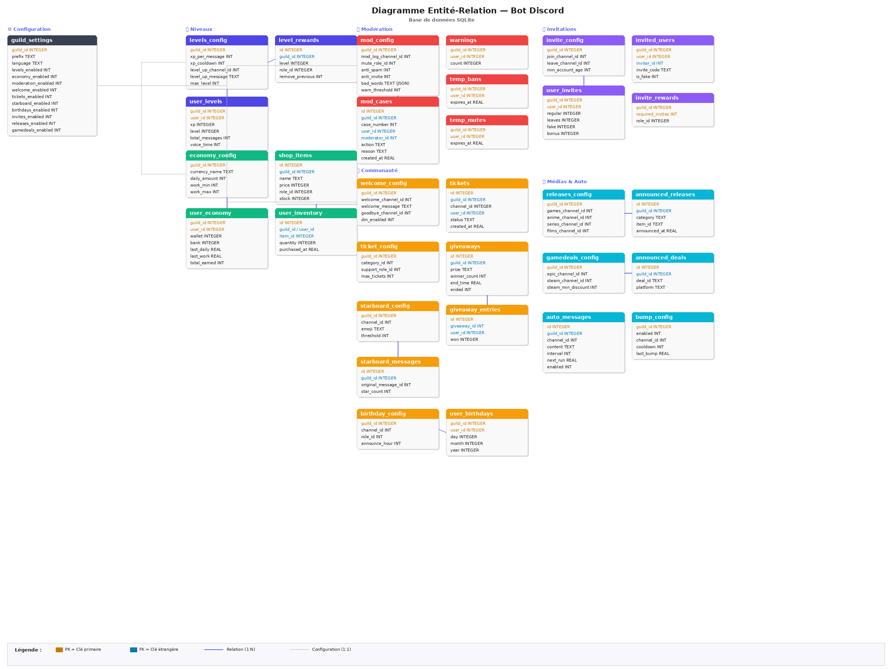

# Design Document

Par Lilian Kozlowski

## Présentation vidéo

`TODO` *(optionnel)*

## Objectif

Cette base de données a pour objectif de gérer l'ensemble des fonctionnalités d'un bot Discord multi-usage destiné à l'administration et l'animation de serveurs communautaires. Inspiré de bots populaires tels que **DraftBot** et **InviteBot**, le système centralise dans une seule base SQLite la gestion de serveurs Discord : niveaux et expérience, économie virtuelle, modération, bienvenue/départs, tickets de support, giveaways, starboard, anniversaires, suivi d'invitations, annonces de sorties médias, alertes de jeux gratuits et messages automatiques.

L'enjeu principal est de permettre à chaque serveur Discord (*guild*) d'avoir une configuration indépendante et personnalisable, tout en gérant des centaines de milliers d'utilisateurs de manière performante. La base doit supporter des lectures fréquentes (affichage de classements, vérification de permissions, consultation de configurations) et des écritures concurrentes (gain d'XP à chaque message, transactions économiques, logs de modération).

## Portée

### Inclus dans la portée

* La configuration par serveur de tous les modules du bot (niveaux, économie, modération, etc.)
* Le suivi de la progression des utilisateurs : XP, niveaux, temps vocal, messages envoyés
* Un système d'économie complet : portefeuille, banque, boutique, inventaire, jeux d'argent
* Les actions de modération : sanctions, avertissements, bans/mutes temporaires, automod
* Les systèmes communautaires : bienvenue, tickets, giveaways, starboard, anniversaires
* Le tracking d'invitations : qui a invité qui, compteurs, récompenses
* Les annonces automatisées : sorties médias, jeux gratuits, messages récurrents

### Hors de la portée

* L'authentification des utilisateurs (gérée par l'API Discord via OAuth2)
* Le stockage des messages Discord eux-mêmes (seuls les métadonnées de modération sont conservées)
* Les données temps réel de présence vocale (seul le cumul est stocké)
* La gestion des fichiers et médias (images de profil, pièces jointes)

## Diagramme Entité-Relation



``` mon code mermaid et lien MERMAID.JS : https://mermaid.ai/d/7f142d96-079a-46b5-a35c-e5993674698f
erDiagram
    guild_settings ||--o| levels_config : "configure"
    guild_settings ||--o| economy_config : "configure"
    guild_settings ||--o| mod_config : "configure"
    guild_settings ||--o| welcome_config : "configure"
    guild_settings ||--o| ticket_config : "configure"
    guild_settings ||--o| starboard_config : "configure"
    guild_settings ||--o| birthday_config : "configure"
    guild_settings ||--o| invite_config : "configure"
    guild_settings ||--o| releases_config : "configure"
    guild_settings ||--o| gamedeals_config : "configure"
    guild_settings ||--o| bump_config : "configure"

    guild_settings ||--o{ user_levels : "contient"
    guild_settings ||--o{ user_economy : "contient"
    guild_settings ||--o{ mod_cases : "contient"
    guild_settings ||--o{ giveaways : "contient"
    guild_settings ||--o{ tickets : "contient"
    guild_settings ||--o{ user_birthdays : "contient"
    guild_settings ||--o{ user_invites : "contient"
    guild_settings ||--o{ auto_messages : "contient"

    user_levels {
        int guild_id PK
        int user_id PK
        int xp
        int level
        int total_messages
        int voice_time
    }

    user_economy {
        int guild_id PK
        int user_id PK
        int wallet
        int bank
        real last_daily
        real last_work
    }

    mod_cases {
        int id PK
        int guild_id
        int user_id
        int moderator_id
        text action
        text reason
    }

    giveaways ||--o{ giveaway_entries : "a"
    giveaways {
        int id PK
        int guild_id
        int message_id
        text prize
        int winner_count
        real end_time
    }

    giveaway_entries {
        int giveaway_id FK
        int user_id
        int won
    }

    user_invites {
        int guild_id PK
        int user_id PK
        int regular
        int leaves
        int fake
        int bonus
    }

    invited_users {
        int guild_id PK
        int user_id PK
        int inviter_id FK
        text invite_code
    }

    levels_config ||--o{ level_rewards : "définit"
    economy_config ||--o{ shop_items : "propose"
    shop_items ||--o{ user_inventory : "acheté par"

    starboard_config ||--o{ starboard_messages : "contient"
    tickets {
        int id PK
        int guild_id
        int channel_id
        int user_id
        text status
    }
```

## Entités

La base de données comprend les entités principales suivantes, regroupées par domaine fonctionnel :

### Configuration des serveurs
La table `guild_settings` est la table centrale. Chaque serveur Discord possède une unique entrée identifiée par son `guild_id` (l'identifiant numérique attribué par Discord). Cette table stocke le préfixe de commande, la langue, et surtout les **toggles d'activation** de chaque module sous forme de colonnes booléennes (`levels_enabled`, `economy_enabled`, `moderation_enabled`, etc.). Ce choix de colonnes plutôt que d'une table de jointure permet des requêtes directes sans jointure pour la vérification la plus fréquente du bot : « ce module est-il activé ? ».

Chaque module dispose ensuite de sa propre **table de configuration** (`levels_config`, `economy_config`, `mod_config`, `welcome_config`, `ticket_config`, `starboard_config`, `birthday_config`, `invite_config`, `releases_config`, `gamedeals_config`, `bump_config`). Toutes ces tables ont `guild_id` comme clé primaire, établissant une relation **un-à-un** avec `guild_settings`.

### Données utilisateurs
Les tables `user_levels` et `user_economy` suivent les progrès des utilisateurs par serveur. La clé primaire composite `(guild_id, user_id)` garantit qu'un utilisateur possède une entrée unique par serveur tout en pouvant être présent sur plusieurs serveurs. La table `user_levels` stocke l'XP courant, le niveau, le nombre total de messages et le temps vocal cumulé. La table `user_economy` stocke le portefeuille (*wallet*), la banque, et les timestamps des dernières actions à cooldown (`last_daily`, `last_work`).

### Économie et boutique
Les tables `shop_items` et `user_inventory` modélisent un système de boutique. `shop_items` est liée à un serveur et décrit chaque article (prix, rôle attribué, stock disponible, rôle requis pour acheter). `user_inventory` crée une relation **plusieurs-à-plusieurs** entre les utilisateurs et les articles, avec une quantité et un timestamp d'achat.

### Modération
La table `mod_cases` fonctionne comme un journal d'audit avec numérotation incrémentale par serveur (`case_number`). Chaque sanction enregistre l'utilisateur ciblé, le modérateur, le type d'action, la raison et le timestamp. Les tables `warnings`, `temp_bans` et `temp_mutes` complètent le système avec respectivement un compteur d'avertissements actifs et des sanctions temporaires dont la tâche de fond vérifie l'expiration.

### Systèmes communautaires
Les `giveaways` et `giveaway_entries` modélisent un système de concours avec un lien **un-à-plusieurs**. Les `tickets` représentent les canaux de support créés dynamiquement. La table `starboard_messages` relie les messages originaux à leur copie dans le salon starboard. La table `user_birthdays` stocke jour, mois et année optionnelle par utilisateur et serveur.

### Suivi d'invitations
Trois tables travaillent ensemble : `user_invites` agrège les compteurs (regular, leaves, fake, bonus) par utilisateur, `invited_users` trace la relation inviteur → invité, et `invite_rewards` définit les seuils de récompenses en rôles.

## Relations

Les relations clés de cette base sont :

* **Un-à-un** : `guild_settings` ↔ chaque table `*_config` — chaque serveur a exactement une configuration par module.
* **Un-à-plusieurs** : `guild_settings` → `user_levels`, `user_economy`, `mod_cases`, `giveaways`, `tickets`, etc. — un serveur contient plusieurs utilisateurs/entrées.
* **Un-à-plusieurs** : `giveaways` → `giveaway_entries` — un giveaway a plusieurs participants.
* **Un-à-plusieurs** : `economy_config` → `shop_items` → `user_inventory` — une boutique contient des articles achetés par des utilisateurs.
* **Un-à-plusieurs** : `levels_config` → `level_rewards` — un système de niveaux définit plusieurs paliers de récompenses.
* **Plusieurs-à-plusieurs implicite** : un utilisateur peut être inviteur de plusieurs membres et chaque membre a un seul inviteur, modélisé via `invited_users`.

La clé composite `(guild_id, user_id)` est le pattern dominant, reflétant le fait que toutes les données sont **scoped** par serveur. Un même utilisateur Discord a des données indépendantes sur chaque serveur.

## Optimisations

### Index

Plusieurs index ont été créés pour optimiser les requêtes les plus fréquentes :

* `idx_user_levels_guild` et `idx_user_levels_xp` : optimisent les classements triés par XP descendant, une requête exécutée à chaque affichage du leaderboard.
* `idx_user_economy_guild` : optimise la recherche de solde et le classement économique.
* `idx_mod_cases_guild` et `idx_mod_cases_user` : permettent la recherche rapide de l'historique de modération par serveur ou par utilisateur.
* `idx_user_invites_guild` et `idx_invited_users_inviter` : optimisent les classements d'invitations et la recherche de « qui a invité qui ».
* `idx_auto_messages_next` : permet à la tâche de fond de trouver efficacement les messages à envoyer en triant par `next_run`.
* `idx_announced_releases` et `idx_announced_deals` : évitent les annonces en double en permettant une recherche rapide par serveur et catégorie.

### Choix de conception pour la performance

* **Dénormalisation contrôlée** : le champ `level` dans `user_levels` est déduit de l'XP mais stocké directement pour éviter un recalcul à chaque message. De même, les compteurs `regular`, `leaves`, `fake`, `bonus` dans `user_invites` sont pré-agrégés.
* **`INSERT OR REPLACE` / `ON CONFLICT`** : les opérations d'upsert sont utilisées massivement pour créer les entrées utilisateurs à la volée (le bot ne peut pas pré-remplir les tables, les utilisateurs apparaissent quand ils interagissent).
* **Colonnes JSON** : `settings_json`, `ignored_channels`, `booster_roles` utilisent du JSON sérialisé pour stocker des listes/dictionnaires flexibles sans créer de tables de jointure supplémentaires, un compromis entre normalisation et simplicité.
* **`UNIQUE` constraints** : utilisées systématiquement pour les clés composites afin d'éviter les doublons sans nécessiter de vérification applicative préalable.

## Limitations

* **SQLite mono-fichier** : en tant que base embarquée, SQLite ne supporte pas les accès concurrents en écriture. Pour un bot présent sur des milliers de serveurs, une migration vers PostgreSQL serait nécessaire. Le mode WAL (Write-Ahead Logging) d'SQLite atténue ce problème pour des charges modérées.
* **Pas de clés étrangères explicites** : pour simplifier les insertions asynchrones et éviter les erreurs de contrainte lorsqu'un utilisateur quitte un serveur, les foreign keys ne sont pas activées. L'intégrité référentielle repose sur la logique applicative.
* **Pas de TTL natif** : les données d'annonces (`announced_releases`, `announced_deals`) et les logs de modération croissent indéfiniment. Un mécanisme de purge périodique devrait être implémenté pour les entrées anciennes.
* **Colonnes JSON non indexables** : les champs stockés en JSON (`ignored_channels`, `booster_roles`, etc.) ne peuvent pas bénéficier d'index SQLite, rendant les requêtes de filtrage sur ces champs moins performantes.
* **Schéma fixe par module** : l'ajout d'un nouveau module nécessite un `ALTER TABLE` sur `guild_settings` pour ajouter le toggle, ce qui est peu flexible comparé à un système de configuration clé-valeur.
* **Identifiants Discord en INTEGER** : les snowflakes Discord sont des entiers 64 bits. SQLite les gère nativement, mais une attention particulière est requise si le schéma est migré vers un SGBD qui distingue `INT` et `BIGINT`.
